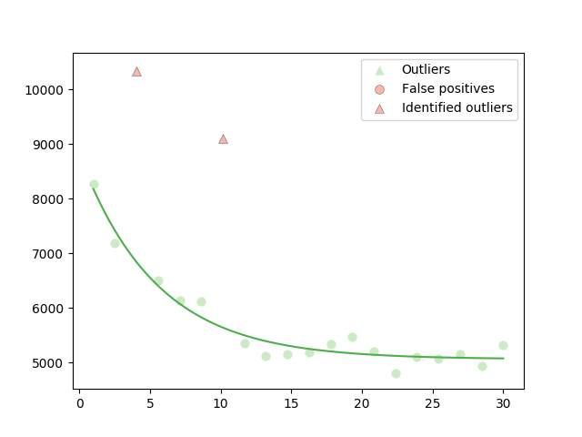

# Random generation of problems

`RAFF.jl` contains several methods for the generation of artificial
datasets, in order to simulate noisy data with outliers. See the
[API](api.md) for details about the possibilities of random generation
of data with outliers.

## Simple example - the exponential function

First, it is necessary to load `RAFF.jl` and the desired model to
generate the problem.

```@repl docrepl
using RAFF

n, model, = RAFF.model_list["expon"]
``` 

If an *exact* solution is not provided, `RAFF.jl` will generate a
random one, but this can destroy the shape of some models. Therefore,
in this example, we will provide a *hint* for a nice exponential
model. In this example, we will generate 20 random points with 2
outliers in the interval ``[1, 30]``.

```@repl docrepl
exact_sol = [5000.0, 4000.0, 0.2]

interv = (1.0, 30.0)

np = 20

p = 18
```

Before calling the generating function, we fix the random seed, so
this example is the same everywhere.

```@repl docrepl
using Random

Random.seed!(12345678)

data, = generate_noisy_data(model, n, np, p, x_interval=interv, θSol=exact_sol)
```

Now we use the script `test/script/draw.jl` (see
[Advanced](advanced.md) section) to visualize the data
generated. `draw.jl` uses the `PyPlot.jl` package, so it is necessary
to install it before running this example.

```
julia> include("test/scripts/draw.jl")

julia> draw_problem(data, model_str="expon")
```

If you are interested in running `RAFF`, just call the [`raff`](@ref)
method. **Attention**: we have to drop the last column of `data`,
since it contains information regarding the noise added to the
outliers.

```@repl docrepl
r = raff(model, data[:, 1:end - 1], n, MAXMS=10)
```
If all the steps were successful, after command
```
julia> draw_problem(data, model_str="expon", raff_output=r)
```
the following picture should appear


